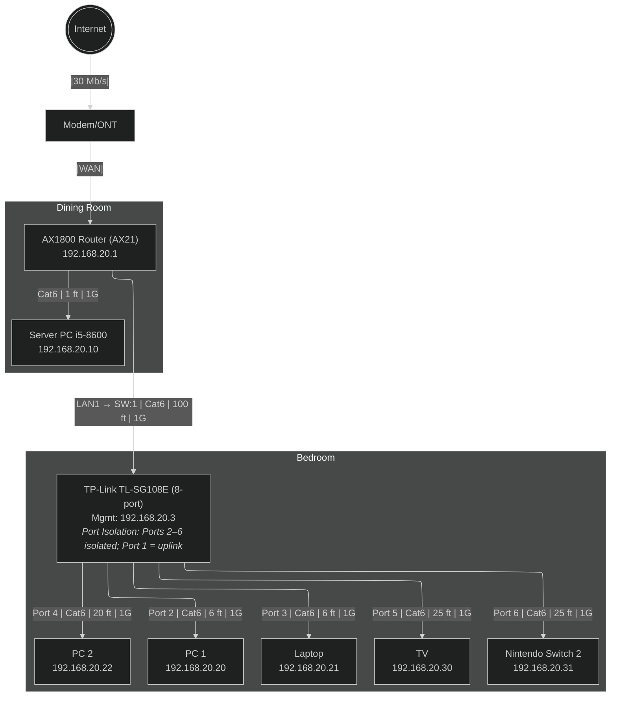

# Home Lab Network Map
Flat LAN. Archer AX21 stays stock (no 802.1Q). Bedroom switch uses **port isolation**. My server allows SMB only from my PCs.

View-only Diagram: <https://www.mermaidchart.com/d/078828cc-05ef-48f1-b4c9-1633ba9b3beb>

